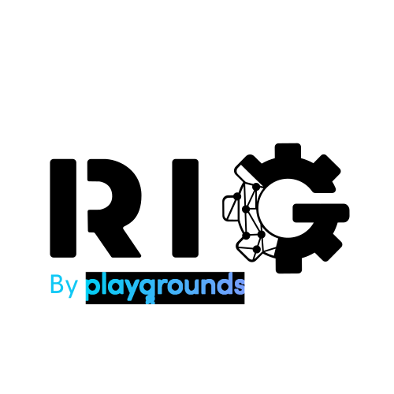

<p align="center">
<picture>
    <source media="(prefers-color-scheme: dark)" srcset="img/rig-playgrounds-dark.svg">
    <source media="(prefers-color-scheme: light)" srcset="img/rig-playgrounds-light.svg">
    
</picture>
<br>
<a href="https://crates.io/crates/rig-core"></a>
&nbsp;
<a href="https://crates.io/crates/rig-core"></a>
&nbsp;
<a href="https://discord.gg/playgrounds"></a>
&nbsp;
<a href="https://github.com/0xPlaygrounds/rig"></a>
<br>
<a href=""></a>
&nbsp;
<a href="https://twitter.com/Playgrounds0x"></a>
<a href="https://docs.rs/rig-core/latest/rig/"></a>
<br>
</p>
&nbsp;

✨ If you would like to help spread the word about Rig, please consider starring the repo!

> [!WARNING]
> Here be dragons! As we plan to ship a torrent of features in the following months, future updates **will** contain **breaking changes**. With Rig evolving, we'll annotate changes and highlight migration paths as we encounter them.


## What is Rig?
Rig is a Rust library for building scalable, modular, and ergonomic **LLM-powered** applications.

More information about this crate can be found in the [crate documentation](https://docs.rs/rig-core/latest/rig/).

Help us improve Rig by contributing to our [Feedback form](https://bit.ly/Rig-Feeback-Form).

## Table of contents

- [What is Rig?](#what-is-rig)
- [Table of contents](#table-of-contents)
- [High-level features](#high-level-features)
- [Get Started](#get-started)
  - [Simple example:](#simple-example)
- [Integrations](#integrations)

## High-level features
- Full support for LLM completion and embedding workflows
- Simple but powerful common abstractions over LLM providers (e.g. OpenAI, Cohere) and vector stores (e.g. MongoDB, in-memory)
- Integrate LLMs in your app with minimal boilerplate


## Get Started
```bash
cargo add rig-core
```

### Simple example:
```rust
use rig::{completion::Prompt, providers::openai};

#[tokio::main]
async fn main() {
    // Create OpenAI client and model
    // This requires the `OPENAI_API_KEY` environment variable to be set.
    let openai_client = openai::Client::from_env();

    let gpt4 = openai_client.agent("gpt-4").build();

    // Prompt the model and print its response
    let response = gpt4
        .prompt("Who are you?")
        .await
        .expect("Failed to prompt GPT-4");

    println!("GPT-4: {response}");
}
```
Note using `#[tokio::main]` requires you enable tokio's `macros` and `rt-multi-thread` features
or just `full` to enable all features (`cargo add tokio --features macros,rt-multi-thread`).

You can find more examples each crate's `examples` (ie. [`src/examples`](./src/examples)) directory. More detailed use cases walkthroughs are regularly published on our [Dev.to Blog](https://dev.to/0thtachi).

## Supported Integrations

| Model Providers | Vector Stores |
|:--------------:|:-------------:|
| <br> <picture><source media="(prefers-color-scheme: dark)" srcset="https://www.fahimai.com/wp-content/uploads/2024/06/Untitled-design-7.png"><source media="(prefers-color-scheme: light)" srcset="https://upload.wikimedia.org/wikipedia/commons/thumb/4/47/Claude_Ai.svg/1024px-Claude_Ai.svg.png"></picture> <br>   <br>  |<br> <br><br> |


Vector stores are available as separate companion-crates:
- MongoDB vector store: [`rig-mongodb`](https://github.com/0xPlaygrounds/rig/tree/main/rig-mongodb)
- LanceDB vector store: [`rig-lancedb`](https://github.com/0xPlaygrounds/rig/tree/main/rig-lancedb)
- Neo4j vector store: [`rig-neo4j`](https://github.com/0xPlaygrounds/rig/tree/main/rig-neo4j)
- Qdrant vector store: [`rig-qdrant`](https://github.com/0xPlaygrounds/rig/tree/main/rig-qdrant)


<p align="center">
<br>
<br>

</p>
