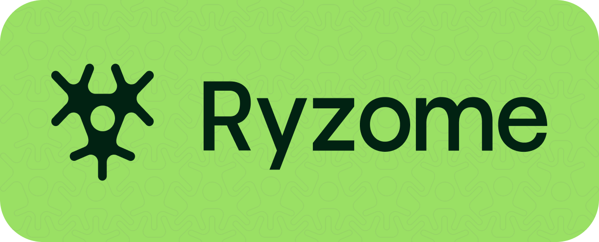

<p align="center">
<picture>
    <source media="(prefers-color-scheme: dark)" srcset="img/rig-rebranded-logo-white.svg">
    <source media="(prefers-color-scheme: light)" srcset="img/rig-rebranded-logo-black.svg">
    
</picture>
<br>
<br>
<a href="https://rig.rs/docs"></a> &nbsp;
<a href="https://docs.rs/rig/latest/rig/"></a> &nbsp;
<a href="https://crates.io/crates/rig"></a>
&nbsp;
<a href="https://crates.io/crates/rig"></a>
&nbsp;
<a href="LICENSE"></a>
</br>
<a href="https://discord.gg/playgrounds"></a>
&nbsp;
<a href=""></a>
&nbsp;
<a href="https://github.com/0xPlaygrounds/rig"></a>
<br>

<br>
</p>
&nbsp;


<div align="center">

[📑 Docs](https://rig.rs/docs)
<span>&nbsp;&nbsp;•&nbsp;&nbsp;</span>
[🌐 Website](https://rig.rs)
<span>&nbsp;&nbsp;•&nbsp;&nbsp;</span>
[🤝 Contribute](https://github.com/0xPlaygrounds/rig/issues/new)
<span>&nbsp;&nbsp;•&nbsp;&nbsp;</span>
[✍🏽 Blogs](https://rig.rs/docs/guides)
<span>&nbsp;&nbsp;•&nbsp;&nbsp;</span>
<a href="https://ryzome.ai"></a>

</div>

✨ If you would like to help spread the word about Rig, please consider starring the repo!

> [!WARNING]
> Here be dragons! As we plan to ship a torrent of features in the following months, future updates **will** contain **breaking changes**. With Rig evolving, we'll annotate changes and highlight migration paths as we encounter them.

## Table of contents

- [Table of contents](#table-of-contents)
- [What is Rig?](#what-is-rig)
- [Features](#features)
- [Runtime choices](#runtime-choices)
- [Who's using Rig?](#who-is-using-rig)
- [Get Started](#get-started)
  - [Simple example](#simple-example)
- [Integrations](#supported-integrations)

## What is Rig?
Rig is a Rust library for building scalable, modular, and ergonomic **LLM-powered** applications.

More information about this crate can be found in the [official](https://rig.rs/docs) and [crate](https://docs.rs/rig/latest/rig/) API reference documentation.

## Features
- Agentic workflows that can handle multi-turn streaming and prompting
- A classic agent runtime enabled by default
- Full [GenAI Semantic Convention](https://opentelemetry.io/docs/specs/semconv/gen-ai/) compatibility
- 20+ model providers, all under one singular unified interface
- 10+ vector store integrations, all under one singular unified interface
- Full support for LLM completion and embedding workflows
- Support for transcription, audio generation and image generation model capabilities
- Integrate LLMs in your app with minimal boilerplate
- Browser-WASM (`wasm32-unknown-unknown`) support for the portable core and
  classic runtime — see [target support](crates/rig-agent/README.md#target-support)
  for the full matrix (WASI is not supported; `rig-rmcp`/MCP is native-only)

## Runtime choices

Rig separates portable provider/backend contracts from agent orchestration:

- `rig-core` contains provider-neutral messages, completion models, portable tools,
  memory and vector-store contracts, and built-in provider mappings.
- `rig-agent` contains the classic builder, prompt/streaming traits, typed hooks,
  contextual tools, extraction, and the serializable `AgentRun` state machine. It
  remains enabled by default.

The root `rig` facade re-exports both at their familiar paths, so most code
depends only on `rig`.

## Who is using Rig?
Rig powers coding agents and developer tools, desktop and terminal AI assistants, retrieval-augmented generation and semantic search, agent memory systems, multi-agent and workflow orchestration frameworks, and production services ranging from genomics research and incident management to decentralised compute networks.

The full list of companies, applications, libraries, and articles lives in [awesome-rig](https://github.com/0xPlaygrounds/awesome-rig), a community-maintained list. Using Rig? Open a pull request there to add your project.

## Get Started
Use the root `rig` facade when you want feature-gated access to companion crates,
or use `rig-core` directly when you only need the core provider abstractions.

```bash
cargo add rig
# or: cargo add rig-core
```

### Simple example
```rust
use rig::prelude::*;
use rig::providers::openai;

#[tokio::main]
async fn main() -> Result<(), anyhow::Error> {
    // Create OpenAI client
    let client = openai::Client::from_env()?;

    // Create agent with a single context prompt
    let comedian_agent = client
        .agent(openai::GPT_5_2)
        .preamble("You are a comedian here to entertain the user using humour and jokes.")
        .build();

    // Prompt the agent and print the response
    let response = comedian_agent.prompt("Entertain me!").await?;

    println!("{}", response.output);

    Ok(())
}
```
Note using `#[tokio::main]` requires you enable tokio's `macros` and `rt-multi-thread` features
or just `full` to enable all features (`cargo add tokio --features macros,rt-multi-thread`).

You can find more examples in each crate's `examples` directory (for example, [`examples`](./examples)). Provider-specific integration coverage lives under [`tests/providers`](./tests/providers), with cassette-backed tests that replay offline by default and live-only tests kept separate when real provider APIs are still required. See [`tests/README.md`](./tests/README.md) for test target, replay, record, and cassette safety commands. More detailed use case walkthroughs are regularly published on our [Dev.to Blog](https://dev.to/0thtachi) and added to Rig's official documentation at [rig.rs/docs](https://rig.rs/docs).

## Supported Integrations

The root `rig` facade exposes companion crates behind one feature per integration:

```toml
rig = { version = "0.36.0", features = ["lancedb", "fastembed"] }
```

| Integration | Crate | Feature | Module path |
| --- | --- | --- | --- |
| AWS Bedrock | [`rig-bedrock`](https://github.com/0xPlaygrounds/rig/tree/main/crates/rig-bedrock) | `bedrock` | `rig::bedrock` |
| AWS S3Vectors | [`rig-s3vectors`](https://github.com/0xPlaygrounds/rig/tree/main/crates/rig-s3vectors) | `s3vectors` | `rig::s3vectors` |
| Candle (local Llama/SmolLM2/Qwen3 tools) | [`rig-candle`](https://github.com/0xPlaygrounds/rig/tree/main/crates/rig-candle) | `candle` | `rig::candle` |
| Cloudflare Vectorize | [`rig-vectorize`](https://github.com/0xPlaygrounds/rig/tree/main/crates/rig-vectorize) | `vectorize` | `rig::vectorize` |
| FastEmbed | [`rig-fastembed`](https://github.com/0xPlaygrounds/rig/tree/main/crates/rig-fastembed) | `fastembed` | `rig::fastembed` |
| Google Gemini gRPC | [`rig-gemini-grpc`](https://github.com/0xPlaygrounds/rig/tree/main/crates/rig-gemini-grpc) | `gemini-grpc` | `rig::gemini_grpc` |
| Google Vertex AI | [`rig-vertexai`](https://github.com/0xPlaygrounds/rig/tree/main/crates/rig-vertexai) | `vertexai` | `rig::vertexai` |
| HelixDB | [`rig-helixdb`](https://github.com/0xPlaygrounds/rig/tree/main/crates/rig-helixdb) | `helixdb` | `rig::helixdb` |
| LanceDB | [`rig-lancedb`](https://github.com/0xPlaygrounds/rig/tree/main/crates/rig-lancedb) | `lancedb` | `rig::lancedb` |
| Memory policies | [`rig-memory`](https://github.com/0xPlaygrounds/rig/tree/main/crates/rig-memory) | `memory` | `rig::memory` |
| Milvus | [`rig-milvus`](https://github.com/0xPlaygrounds/rig/tree/main/crates/rig-milvus) | `milvus` | `rig::milvus` |
| MongoDB | [`rig-mongodb`](https://github.com/0xPlaygrounds/rig/tree/main/crates/rig-mongodb) | `mongodb` | `rig::mongodb` |
| Neo4j | [`rig-neo4j`](https://github.com/0xPlaygrounds/rig/tree/main/crates/rig-neo4j) | `neo4j` | `rig::neo4j` |
| PostgreSQL | [`rig-postgres`](https://github.com/0xPlaygrounds/rig/tree/main/crates/rig-postgres) | `postgres` | `rig::postgres` |
| Qdrant | [`rig-qdrant`](https://github.com/0xPlaygrounds/rig/tree/main/crates/rig-qdrant) | `qdrant` | `rig::qdrant` |
| ScyllaDB | [`rig-scylladb`](https://github.com/0xPlaygrounds/rig/tree/main/crates/rig-scylladb) | `scylladb` | `rig::scylladb` |
| SQLite | [`rig-sqlite`](https://github.com/0xPlaygrounds/rig/tree/main/crates/rig-sqlite) | `sqlite` | `rig::sqlite` |
| SurrealDB | [`rig-surrealdb`](https://github.com/0xPlaygrounds/rig/tree/main/crates/rig-surrealdb) | `surrealdb` | `rig::surrealdb` |

`rig::memory` is available without the `memory` feature; it contains the core
conversation memory traits and in-memory backend re-exported from `rig-core`.
Enabling `features = ["memory"]` adds reusable history-shaping policy types from
the `rig-memory` companion crate to the same module.

We also have some other associated crates that have additional functionality you may find helpful when using Rig:
- `rig-onchain-kit` - the [Rig Onchain Kit.](https://github.com/0xPlaygrounds/rig-onchain-kit) Intended to make interactions between Solana/EVM and Rig much easier to implement.


<p align="center">
<br>
<br>

</p>
