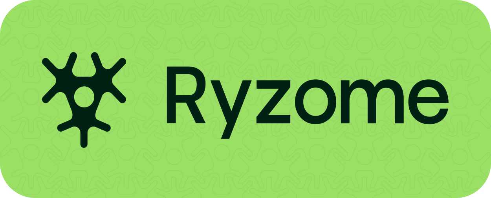

<p align="center">
<picture>
    <source media="(prefers-color-scheme: dark)" srcset="img/rig-rebranded-logo-white.svg">
    <source media="(prefers-color-scheme: light)" srcset="img/rig-rebranded-logo-black.svg">
    
</picture>
<br>
<br>
<a href="https://rig.rs/docs"></a> &nbsp;
<a href="https://docs.rs/rig/latest/rig/"></a> &nbsp;
<a href="https://crates.io/crates/rig"></a>
&nbsp;
<a href="https://crates.io/crates/rig"></a>
&nbsp;
<a href="LICENSE"></a>
</br>
<a href="https://discord.gg/playgrounds"></a>
&nbsp;
<a href=""></a>
&nbsp;
<a href="https://github.com/0xPlaygrounds/rig"></a>
<br>

<br>
</p>
&nbsp;


<div align="center">

[📑 Docs](https://rig.rs/docs)
<span>&nbsp;&nbsp;•&nbsp;&nbsp;</span>
[🌐 Website](https://rig.rs)
<span>&nbsp;&nbsp;•&nbsp;&nbsp;</span>
[🤝 Contribute](https://github.com/0xPlaygrounds/rig/issues/new)
<span>&nbsp;&nbsp;•&nbsp;&nbsp;</span>
[✍🏽 Blogs](https://rig.rs/docs/guides)
<span>&nbsp;&nbsp;•&nbsp;&nbsp;</span>
<a href="https://ryzome.ai"></a>

</div>

✨ If you would like to help spread the word about Rig, please consider starring the repo!

> [!WARNING]
> Here be dragons! As we plan to ship a torrent of features in the following months, future updates **will** contain **breaking changes**. With Rig evolving, we'll annotate changes and highlight migration paths as we encounter them.

## Table of contents

- [Table of contents](#table-of-contents)
- [What is Rig?](#what-is-rig)
- [Features](#features)
- [Runtime choices](#runtime-choices)
- [Who's using Rig?](#who-is-using-rig)
- [Get Started](#get-started)
  - [Simple example](#simple-example)
- [The rig coding agent](#the-rig-coding-agent)
- [Integrations](#supported-integrations)

## What is Rig?
Rig is a Rust library for building scalable, modular, and ergonomic **LLM-powered** applications.

More information about this crate can be found in the [official](https://rig.rs/docs) and [crate](https://docs.rs/rig/latest/rig/) API reference documentation.

## Features
- Agentic workflows that can handle multi-turn streaming and prompting
- A classic agent runtime enabled by default
- Full [GenAI Semantic Convention](https://opentelemetry.io/docs/specs/semconv/gen-ai/) compatibility
- 20+ model providers, all under one singular unified interface
- 10+ vector store integrations, all under one singular unified interface
- Full support for LLM completion and embedding workflows
- Support for transcription, audio generation and image generation model capabilities
- Integrate LLMs in your app with minimal boilerplate
- Browser-WASM (`wasm32-unknown-unknown`) support for the portable core and
  classic runtime — see [target support](crates/rig-agent/README.md#target-support)
  for the full matrix (WASI is not supported; `rig-rmcp`/MCP is native-only)

## Runtime choices

Rig separates portable provider/backend contracts from agent orchestration:

- `rig-core` contains provider-neutral messages, completion models, portable and
  contextual tool contracts, memory and vector-store contracts, and built-in
  provider mappings.
- `rig-agent` contains the classic builder, prompt/streaming traits, typed hooks,
  the live tool registry, extraction, and the serializable `AgentRun` state machine. It
  remains enabled by default.

The root `rig` facade re-exports both at their familiar paths, so most code
depends only on `rig`.

Hosts construct HTTP or SDK models with their chosen authentication, transport
policy and runtime lifetime; the agent runtime executes the resulting
`Model` through one shared adapter. Effect replay uses recorded handlers and
does not require live provider construction.

## Who is using Rig?
Below is a non-exhaustive list of companies and people who are using Rig:
- [St Jude](https://www.stjude.org/) - Using Rig for a chatbot utility as part of [`proteinpaint`](https://github.com/stjude/proteinpaint), a genomics visualisation tool.
- [Coral Protocol](https://www.coralprotocol.org/) - Using Rig extensively, both internally as well as part of the [Coral Rust SDK.](https://github.com/Coral-Protocol/coral-rs)
- [VT Code](https://github.com/vinhnx/vtcode) - VT Code is a Rust-based terminal coding agent with semantic code intelligence via Tree-sitter and ast-grep. VT Code uses `rig` for simplifying LLM calls and implementing the model picker.
- [Con](https://github.com/nowledge-co/con) - Con is a GPU-accelerated terminal emulator with a built-in AI agent harness. It uses Rig as the provider abstraction layer for its integrated coding agents.
- [Dria](https://dria.co/) - a decentralised AI network. Currently using Rig as part of their [compute node.](https://github.com/firstbatchxyz/dkn-compute-node)
- [Nethermind](https://www.nethermind.io/) - Using Rig as part of their [Neural Interconnected Nodes Engine](https://github.com/NethermindEth/nine) framework.
- [Neon](https://neon.com) - Using Rig for their [app.build](https://github.com/neondatabase/appdotbuild-agent) V2 reboot in Rust.
- [Listen](https://github.com/piotrostr/listen) - A framework aiming to become the go-to framework for AI portfolio management agents. Powers [the Listen app.](https://app.listen-rs.com/)
- [Cairnify](https://cairnify.com/) - helps users find documents, links, and information instantly through an intelligent search bar. Rig provides the agentic foundation behind Cairnify’s AI search experience, enabling tool-calling, reasoning, and retrieval workflows.
- [Ryzome](https://ryzome.ai) - Ryzome is a visual AI workspace that lets you build interconnected canvases of thoughts, research, and AI agents to orchestrate complex knowledge work.
- [deepwiki-rs](https://github.com/sopaco/deepwiki-rs) - Turn code into clarity. Generate accurate technical docs and AI-ready context in minutes—perfectly structured for human teams and intelligent agents.
- [Cortex Memory](https://github.com/sopaco/cortex-mem) - The production-ready memory system for intelligent agents. A complete solution for memory management, from extraction and vector search to automated optimization, with a REST API, MCP, CLI, and insights dashboard out-of-the-box.
- [Ironclaw](https://github.com/nearai/ironclaw) - A secure personal AI assistant
- [ilert](https://www.ilert.com/) - Incident management & alerting platform. Uses Rig as the multi-provider abstraction in its agentic LLM proxy powering ilert AI.
- [Archestra](https://github.com/archestra-ai/archestra) - MCP-native secure AI platform. Uses Rig in its agentic benchmark.

For a curated list of Rig projects, libraries, tools, articles, and production users, check out [awesome-rig](https://github.com/0xPlaygrounds/awesome-rig).

Are you also using Rig? [Open an issue](https://www.github.com/0xPlaygrounds/rig/issues) to have your name added!

## Get Started
Use the root `rig` facade when you want feature-gated access to companion crates,
or use `rig-core` directly when you only need the core provider abstractions.

```bash
cargo add rig
# or: cargo add rig-core
```

### Simple example
```rust
use rig::prelude::*;
use rig::providers::openai::{self, OpenAI};

#[tokio::main]
async fn main() -> Result<(), anyhow::Error> {
    // The client reads `OPENAI_API_KEY` and builds the models it serves.
    let model = OpenAI::from_env()?.completion(openai::GPT_5_2);
    let comedian_agent = AgentBuilder::new(model)
        .preamble("You are a comedian here to entertain the user using humour and jokes.")
        .build();

    // Prompt the agent and print the response
    let response = comedian_agent.prompt("Entertain me!").await?;

    println!("{}", response.output());

    Ok(())
}
```
Note using `#[tokio::main]` requires you enable tokio's `macros` and `rt-multi-thread` features
or just `full` to enable all features (`cargo add tokio --features macros,rt-multi-thread`).

More examples live in [`examples`](./examples) and each crate's `examples` directory; provider test coverage and cassette commands are described in [`tests/README.md`](./tests/README.md). Detailed walkthroughs are published on our [Dev.to Blog](https://dev.to/0thtachi) and at [rig.rs/docs](https://rig.rs/docs).

## Recording and replay

With the `cassette` feature, `rig::cassette::effect_log` provides logs,
recorders, replay handlers and checkpoints. Keep an `EffectLogRecorder` handle
and attach its clone with `AgentBuilder::record_to`; import
`rig::cassette::agent::AgentReplayExt` to stamp the resulting log or check
replay compatibility.

For transport-free consumers, depend directly on `rig-cassette` with default
features disabled. Its optional `agent` adapter is independent of the native
`http` engine. The agent runtime does not depend on the concrete logging
crate. See the [cassette README](crates/rig-cassette/README.md) for
dependency guarantees and migration paths.

## The rig coding agent

`cargo install rig` also installs `rig`, a terminal coding agent. The agent is
the [`rig-harness`](crates/rig-harness) crate, a Bevy app, and `rig` is its launcher:
it generates a small Cargo project for the agent, builds it, and runs it. Its
coding tools (`read`, `write`, `edit`, `search`, `shell`) are the
[`rig-tools`](crates/rig-tools) crate, usable by any rig agent, and its agent
runtime (agents, turns and tool calls as Bevy entities, one recorded effect
path, session journals) is the [`rig-ecs`](crates/rig-ecs) crate, for building
your own harness.

```bash
cargo install rig
export OPENAI_API_KEY=...   # or any other provider key in the model catalog
rig                         # builds the agent (later starts rebuild what changed), then opens it
```

On Linux, building the agent needs the ALSA development headers
(`libasound2-dev` on Debian and Ubuntu, `alsa-lib-devel` on Fedora,
`alsa-lib` on Arch): its `inspect` plugin is built on Bevy Remote, which
pulls in Bevy's audio crate. The agent plays no sound.

In the agent, `/model` picks a model (providers that need no key, such as a
local Ollama, are listed last), `/effort` its reasoning setting, `/help`
lists the commands, and Esc stops a running turn. The status line shows the
session's tokens (uncached input, output, cache reads and writes), its cost
(the provider's figure, else the catalog's list price; `+` when some calls had
no price) and the context in use against the model's window; `/usage` breaks
them down. A model call that fails on a rate limit, an overloaded provider
or a dropped connection is retried up to four times, waiting as long as the
provider's `Retry-After` asks (or 2, 4, 8, 16 seconds); if it still fails,
your message stays in the conversation and `/retry` sends it again. When the
conversation outgrows the model's context window, older tool outputs are
cleared and the call is sent again. Models whose catalog entry lists a prompt
cache get it, with the agent's id as the cache key where the provider takes
one. When the conversation comes within 16k tokens of the model's window,
older tool outputs are cleared and, if that is not enough, the older messages
are summarized by the model into a structured checkpoint (goal, progress,
decisions, next steps, files read and changed) that requests send in their
place; the newest 20k tokens stay as they are. `/compact` does it now, and
`/compact <focus>` says what the summary should keep. The summarized messages
stay in the transcript, under a line that shows the summary; a resumed
session starts from the messages the summary kept. `/reload` rebuilds the agent
and restarts it on the same session; typed while a turn runs, it waits until no
turn runs (`/reload cancel` drops it), and a turn started during the build
delays the restart until it ends. The agent can ask for a reload itself with
its `reload` tool, which waits the same way and shows a notice. It shows cargo's progress, keeps the
current build running if the new one does not compile (Esc closes the
compiler output it shows), and rolls back to it if
the new one crashes during startup.

Every build, the one before each start and `/reload`'s, writes its whole
output (the launcher's and cargo's) to `RIG_HOME/build.log`, and a failure
message names its reason and first compiler error. The agent sees build
failures too: the reason, the first errors and the paths of `build.log`,
`plugins.toml` and the generated project go into its conversation as a
message from the `build` plugin, which starts no turn when the agent is idle
and is saved with the session.
Ask it why the build failed and it can read the log, fix the cause, and
reload.

The session is written as it happens. Each agent, subagents included, has an
append-only log, `sessions/<id>/<agent-id>.jsonl`, of its messages, settings,
usage and compactions; images are stored once in `blobs/`, and `meta.json`
caches what `/resume` lists. A tool call that may change something starts
only once the reply that asked for it is on disk. After a crash, a closed
terminal or a `/quit` mid-turn, the next start reads the logs back and settles what
was left half done: read-only tool calls run again, other unfinished tool
calls are answered as interrupted by the restart, and a turn that waited on
the model carries on.
If the agent crashes or the terminal closes, the next `rig` in the same
directory resumes the session. `/quit` ends it. `/new` starts a new session, `/name`
names this one, and `/resume` lists the earlier ones (name or first message,
cost, directory, age) and resumes the one picked, in its own directory;
and `rig --resume <id>` resumes a given one.

A ChatGPT subscription can pay for the model
calls instead of an API key: `/login chatgpt` opens your browser on the
ChatGPT sign-in page and shows its URL in case the browser does not open; the
page returns to a one-shot listener on `127.0.0.1` port 1455 (1457 when 1455
is taken). Without a graphical session (no `DISPLAY` or `WAYLAND_DISPLAY` on
Linux and the BSDs), over SSH, or when both ports are taken, it shows a code
to enter at `https://auth.openai.com/codex/device` instead, as
`/login chatgpt --device` does. The same applies in print mode, which prints
the URL or code. Once signed in, `/model` lists the
plan's models as `chatgpt/...`, marked "(ChatGPT plan)": `gpt-6.1-sol`,
`gpt-6-astra`, `gpt-6-sol`, `gpt-6-luna`, `gpt-5.6-sol`, `gpt-5.6-terra`,
`gpt-5.6-luna` and `gpt-5.5`, besides the older `gpt-5.4` and `gpt-5.3` rows.
A successful sign-in switches the agent to the plan's latest frontier model,
`chatgpt/gpt-6.1-sol`. Esc or a second `/login` cancels a sign-in that waits. The credential is kept
in `RIG_HOME/auth/chatgpt.json`, readable by you alone, and refreshed before
a request when it has expired, so a long session keeps working;
`/logout chatgpt` deletes it. It is rig's own sign-in, separate from the Codex
CLI's. A `CHATGPT_ACCESS_TOKEN` in the environment (with `CHATGPT_ACCOUNT_ID`)
is used instead when set. `rig -p /login` signs in without the terminal view.

Typing while the agent works is fine: Enter steers the running turn (the
message goes to the model with its next call, after the tool results it waits
for) and Tab queues a follow-up that is sent when the turn would end. Both
wait under the transcript; Esc stops the turn and puts them back in the input.
`@path` to a PNG, JPEG, GIF or WebP file attaches the image when the model
reads images, and Ctrl+V pastes the clipboard's image (through `wl-paste`,
`xclip` or `pngpaste`) as such a path; a dropped image file becomes one too.

With the built-in `SubagentsPlugin`, the model can hand work to subagents
with the `task` tool: each is a new agent in the same process, with its own
conversation and, if the call asks, another model, reasoning setting or a
subset of the tools. `task` returns the subagent's id at once, and `message`
sends one of the model's own subagents a follow-up, which it reads with its
conversation kept. Each `task` or `message` call is a request, and exactly one
report for it (done, failed or interrupted) arrives later as a message to the
agent that sent it, which starts a turn of an idle agent or follows the
running one; reports that arrive together go to the model in one step, and a
report that only points at another (answered together with it) starts no turn
of its own. Nothing waits for them, so you can keep talking to the main
agent, or steer it, meanwhile. Esc stops only the shown agent's turn, not its
subagents. `/agents` lists every agent with its model and state, and
shows the one picked: its transcript, and what you type then goes to it. A
subagent can start subagents of its own, one level deep. Subagents started
with `peers` can also send each other requests with `message`, answered the
same way, to the one that asked; one never asks a peer that waits on its own
report.
In the effect log, a subagent's model calls name the call that gave it its
work as their parent.

Without the terminal view, `rig -p "fix the failing test"` answers one prompt
and exits: the answer goes to stdout, failures to stderr, and the exit code is
0 when the turn ended with an answer, 2 for a refused slash command. Text piped
in follows the prompt (`git diff | rig -p "review this"`), `-m vendor/model`
picks the model (else the session's, else the first one with a key; in the
terminal view too), and `-r <id>` resumes a given
session instead of starting a new one. A headless run never becomes the
session its directory resumes.

The system prompt includes the instruction files `AGENTS.md` (or `CLAUDE.md`)
of `RIG_HOME`, of the working directory and of each directory above it, from
the most general to the most specific, at most 32 KB each and 64 KB together,
along with the working directory, platform and date. They are
re-read when a turn starts, so an edited `AGENTS.md` counts from the next
message; `/context` re-reads them now and lists what the prompt holds.

The input takes several lines: Enter sends, Shift+Enter, Ctrl+J or `\` before
Enter starts a new line, Up and Down move between lines and through the
prompts sent before (kept in `RIG_HOME/history.jsonl`), and the usual emacs
keys edit (Ctrl+A/E/K/U/W, Alt+B/F/D). A leading `/` completes command names
and `@` completes paths of the project (skipping what `.gitignore` leaves out);
Tab or Enter takes the selected one. A command that is unknown or refused, such
as one with arguments it does not take, comes back in the input with the
reason; Enter then sends it to the model as it is. Ctrl+C clears the input. Answers are drawn as markdown, edits as diffs, and each built-in
tool's call in its own way; a plugin can draw its own tools' calls with
`app.add_tool_renderer` (`rig_harness::tui::AppToolRenderersExt`). PageUp, PageDown and
Shift+Up/Down scroll the transcript.

Every file lives under `RIG_HOME` (default `~/.rig`): the plugin list
`plugins.toml`, `/login`'s credentials in `auth/`, the generated `project/`, cargo's `target/`, the builds in `bin/`, the last build's output `build.log`,
the prompt history `history.jsonl`, the last chosen model and reasoning `defaults.json` (a new session starts with them), and `sessions/<id>/` with the agent logs, `meta.json`, `blobs/`, the effect log `effects.jsonl`,
`spill/` (the whole output of a `shell` call that was cut, which the model reads
by the path the cut output names) and the log `agent.log`. `target/` holds cargo's build of the agent and takes a few
gigabytes; set `RIG_HOME` to put everything elsewhere, for example under a
cache directory. Several `rig` processes can share one `RIG_HOME`.

To run the agent from a rig checkout instead of crates.io, install the
launcher from it or point `RIG_SOURCE` at it:

```bash
cd rig && cargo install --path . --root /some/dir
RIG_HOME=/some/dir/home RIG_SOURCE=$PWD /some/dir/bin/rig
```

Plugins are Bevy plugins, listed in `$RIG_HOME/plugins.toml`; `/reload`
rebuilds the agent with them and restarts in the same session. Everything but
the core (the session, the launcher protocol and `/reload`) is an entry in the
same list: the project context, sign-in, sessions, compaction, usage, the
effect log, the tools, the commands, the subagents, `--print` and the terminal
view, so any of them can be removed or replaced:

```toml
[[plugin]]
plugin = "rig_harness::plugins::tools::ReadTool"

[[plugin]]
plugin = "rig_harness::tui::TuiPlugin"

[[plugin]]
crate = "hello"                   # the package name
path = "plugins/hello"            # relative to plugins.toml; or git = "..." (branch, rev), or version = "..."
plugin = "hello::HelloPlugin"     # implements Plugin + Default
bevy_features = []                # optional extra Bevy features
```

`rig plugin new hello` makes that crate in `$RIG_HOME/plugins/hello`, outside
any workspace, and adds its entry; `rig plugin add <type> --path <dir>` (or
`--git`, `--version`) adds an entry for an existing crate and `rig plugin
remove <type>` takes one out (its crate stays), each checked before
plugins.toml is written; `rig plugin check` checks the list, with `--build`
also building the agent with its plugins in `$RIG_HOME/target` without
staging it. A plugin crate depends on
`rig-harness` alone and registers tools, slash commands, tool renderers,
terminal panels or a window the way the built-in ones do, never by editing
rig-harness. [`crates/rig-harness/PLUGINS.md`](crates/rig-harness/PLUGINS.md)
is a cookbook with a copy-ready example of each kind, every name it uses from
`rig_harness::prelude`, and the `src/lib.rs` that `rig plugin new` writes is a
working, commented slash command. An agent started by the launcher knows all
this from its system prompt, so it can write and add its own plugins.

Code mode is an optional plugin crate, `rig-steel`, not in the default list.
Its `SteelPlugin` adds the `run_steel` tool: the model writes one
[Steel](https://github.com/mattwparas/steel) (Scheme) program that spawns
agents, sends them requests, waits for their replies and calls the model's own
tools, and the value of its last expression is the tool's output. The program
reaches the host only through four functions, each one call of rig-steel's
`Harness` handle: `(spawn-agent name [options])`, `(send agent text)`,
`(reply request)` and `(call-tool name [args])`. It runs on a thread of its
own, which each host function blocks until the harness answers; agents it has
sent to work at the same time, so sending to several before waiting fans out.
It runs in Steel's sandboxed engine with the host modules (process, git,
network, foreign functions, threads) emptied, and programs that name module
loading, `eval`, procedural macros or the engine's private functions are
refused. Its execution time (not counting waits), host calls and output are
limited, and Esc cancels it. Enable it with:

```toml
[[plugin]]
crate = "rig-steel"
path = "/path/to/rig/crates/rig-steel"
plugin = "rig_steel::SteelPlugin"
```

Two agents writing a poem together, relayed four times, then summarised:

```scheme
(define a (spawn-agent "poet-a"))
(define b (spawn-agent "poet-b"))
(define (ask agent text) (reply (send agent text)))
(define poem
  (let loop ([turn 0] [stanzas (list (ask a "Write the first stanza of a poem about the sea."))])
    (if (= turn 4)
        stanzas
        (loop (+ turn 1)
              (append stanzas
                      (list (ask (if (even? turn) b a)
                                 (string-append "Continue this poem with one stanza:\n\n"
                                                (string-join stanzas "\n\n")))))))))
(hash 'poem poem
      'summary (ask a (string-append "Summarise this poem in one sentence:\n\n"
                                     (string-join poem "\n\n"))))
```

A fan-out that asks three agents at once and keeps the shortest answer:

```scheme
(define agents (map (lambda (i) (spawn-agent (string-append "solver-" (number->string i)))) (range 0 3)))
(define requests (map (lambda (agent) (send agent "How does src/lib.rs load plugins? Three sentences.")) agents))
(define answers (map reply requests))
(foldl (lambda (answer best) (if (< (string-length answer) (string-length best)) answer best))
       (car answers) (cdr answers))
```

The agent, like the rest of the workspace, needs Rust 1.97.1 or newer.

`rig build` regenerates and builds the agent without starting it.
`CARGO_BUILD_JOBS` sets cargo's `-j` for these builds, as for any cargo build.

The agent runs on Linux and macOS; Windows is not supported yet.

## Supported Integrations

The built-in `rig::vector_store::in_memory_store::InMemoryVectorStore` stores
serializable documents without requiring `Eq` or `Default`. Its custom ID
callbacks accept closures that capture and mutate application state. See the
[vector-search example](examples/vector_search/src/main.rs).

The root `rig` facade exposes companion crates behind one feature per integration:

```toml
rig = { version = "0.36.0", features = ["lancedb", "fastembed"] }
```

| Integration | Crate | Feature | Module path |
| --- | --- | --- | --- |
| AWS Bedrock | [`rig-bedrock`](https://github.com/0xPlaygrounds/rig/tree/main/crates/rig-bedrock) | `bedrock` | `rig::bedrock` |
| AWS S3Vectors | [`rig-s3vectors`](https://github.com/0xPlaygrounds/rig/tree/main/crates/rig-s3vectors) | `s3vectors` | `rig::s3vectors` |
| Candle (local Llama/SmolLM2/Qwen3 tools, YOLOv8 pose) | [`rig-candle`](https://github.com/0xPlaygrounds/rig/tree/main/crates/rig-candle) | `candle` | `rig::candle` |
| Cloudflare Vectorize | [`rig-vectorize`](https://github.com/0xPlaygrounds/rig/tree/main/crates/rig-vectorize) | `vectorize` | `rig::vectorize` |
| FastEmbed | [`rig-fastembed`](https://github.com/0xPlaygrounds/rig/tree/main/crates/rig-fastembed) | `fastembed` | `rig::fastembed` |
| Google Gemini gRPC | [`rig-gemini-grpc`](https://github.com/0xPlaygrounds/rig/tree/main/crates/rig-gemini-grpc) | `gemini-grpc` | `rig::gemini_grpc` |
| Google Vertex AI | [`rig-vertexai`](https://github.com/0xPlaygrounds/rig/tree/main/crates/rig-vertexai) | `vertexai` | `rig::vertexai` |
| HelixDB | [`rig-helixdb`](https://github.com/0xPlaygrounds/rig/tree/main/crates/rig-helixdb) | `helixdb` | `rig::helixdb` |
| LanceDB | [`rig-lancedb`](https://github.com/0xPlaygrounds/rig/tree/main/crates/rig-lancedb) | `lancedb` | `rig::lancedb` |
| Memory policies | [`rig-memory`](https://github.com/0xPlaygrounds/rig/tree/main/crates/rig-memory) | `memory` | `rig::memory` |
| Milvus | [`rig-milvus`](https://github.com/0xPlaygrounds/rig/tree/main/crates/rig-milvus) | `milvus` | `rig::milvus` |
| MongoDB | [`rig-mongodb`](https://github.com/0xPlaygrounds/rig/tree/main/crates/rig-mongodb) | `mongodb` | `rig::mongodb` |
| Neo4j | [`rig-neo4j`](https://github.com/0xPlaygrounds/rig/tree/main/crates/rig-neo4j) | `neo4j` | `rig::neo4j` |
| PostgreSQL | [`rig-postgres`](https://github.com/0xPlaygrounds/rig/tree/main/crates/rig-postgres) | `postgres` | `rig::postgres` |
| Qdrant | [`rig-qdrant`](https://github.com/0xPlaygrounds/rig/tree/main/crates/rig-qdrant) | `qdrant` | `rig::qdrant` |
| ScyllaDB | [`rig-scylladb`](https://github.com/0xPlaygrounds/rig/tree/main/crates/rig-scylladb) | `scylladb` | `rig::scylladb` |
| SQLite | [`rig-sqlite`](https://github.com/0xPlaygrounds/rig/tree/main/crates/rig-sqlite) | `sqlite` | `rig::sqlite` |
| SurrealDB | [`rig-surrealdb`](https://github.com/0xPlaygrounds/rig/tree/main/crates/rig-surrealdb) | `surrealdb` | `rig::surrealdb` |
| TypeSafe Jev (experimental judgments) | [`rig-typesafeai`](crates/rig-typesafeai) | `typesafeai` | `rig::typesafeai` |

`rig::memory` is available without the `memory` feature; it contains the core
conversation memory traits and in-memory backend re-exported from `rig-core`.
Enabling `features = ["memory"]` adds reusable history-shaping policy types from
the `rig-memory` companion crate to the same module.

We also have some other associated crates that have additional functionality you may find helpful when using Rig:
- `rig-onchain-kit` - the [Rig Onchain Kit.](https://github.com/0xPlaygrounds/rig-onchain-kit) Intended to make interactions between Solana/EVM and Rig much easier to implement.


<p align="center">
<br>
<br>

</p>
