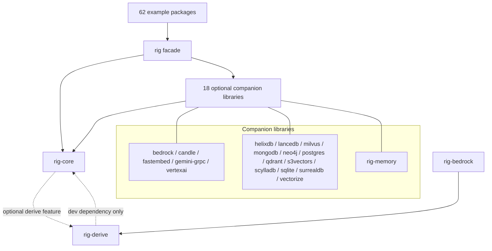
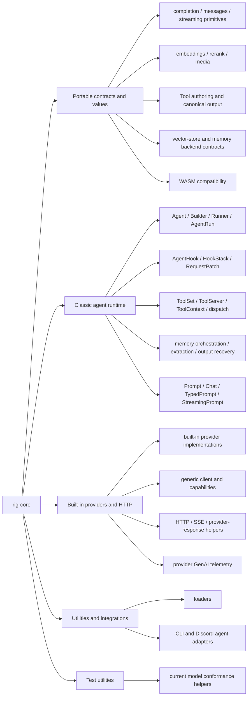
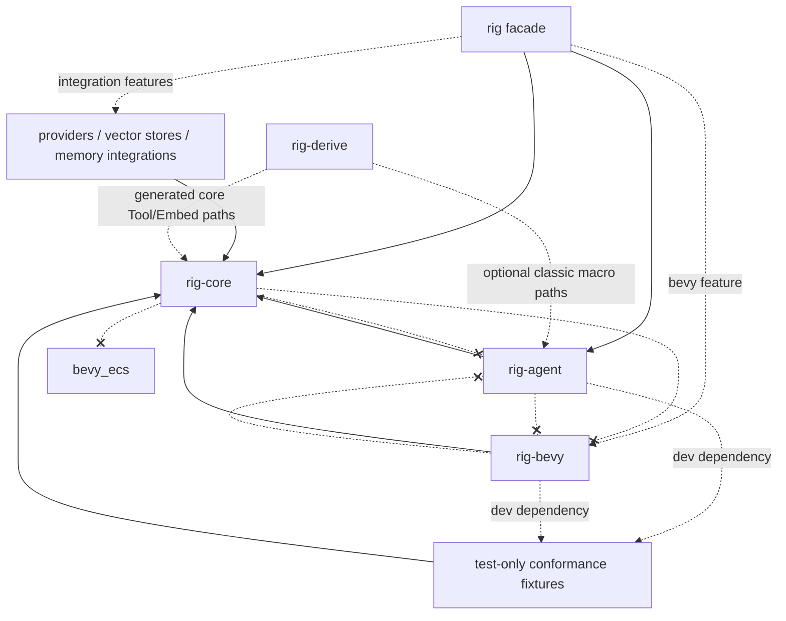
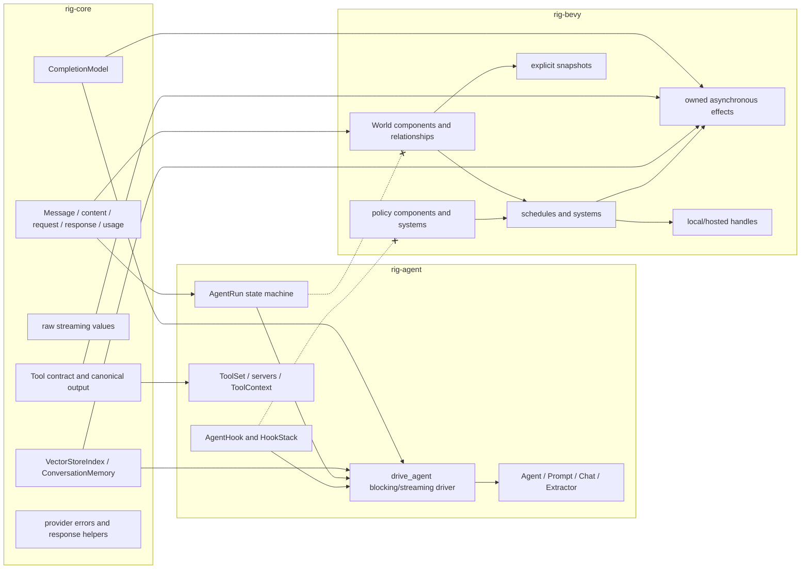
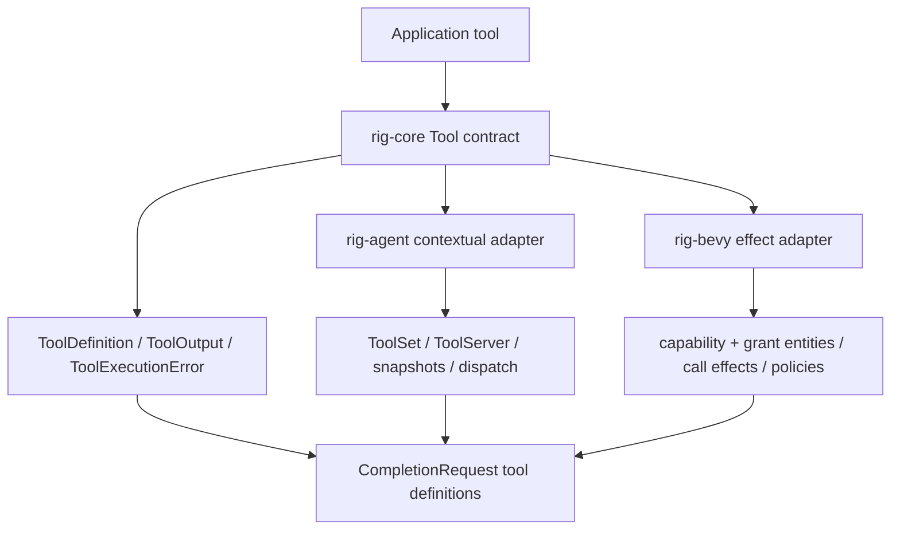
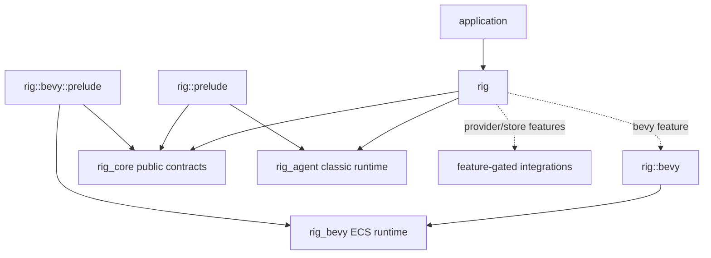
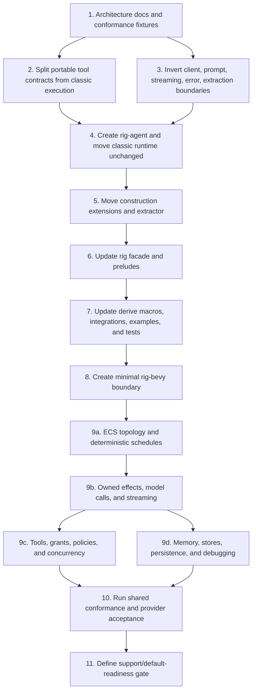

# Rig runtime split research package

> **Historical research snapshot.** This package records the analysis made at
> baseline `87f3f5b77a3caeffa10d60225c41e386753bf05e`. The migration was
> implemented in `940483b4fb30aa77d83dab52a1599652cb9e0c2a` and is documented
> for users in [`docs/runtime-migration.md`](../../runtime-migration.md).
> Baseline source evidence below is pinned to the researched commit.

Status: accepted and implemented. The proposed/current terminology in this
package describes the research baseline and its target, not the post-migration
working tree.

The recommendation is a three-crate topology implemented as a narrow contracts
layer plus two independent runtimes:

- `rig-core` owns provider-neutral contracts, canonical values, and low-level
  provider transport contracts;
- `rig-agent` owns the current classic runtime, including its sans-I/O
  `AgentRun`, shared blocking/streaming driver, typed hooks, tools, memory
  orchestration, extraction, and agent telemetry;
- `rig-bevy` owns a Bevy ECS-native runtime: components, relationships,
  schedules, systems, effects, policies, persistence, and runtime handles;
- `rig` remains the facade. Its default prelude selects the classic runtime;
  Bevy APIs live under `rig::bevy` and `rig::bevy::prelude`.

The topology alone is insufficient. The two runtimes must share behavioral
specifications and conformance fixtures, not a common orchestration state
machine. This combines option 3 (three crates) with option 5 (narrow contracts,
independent runtimes, shared conformance) from the architecture evaluation.

## Package contents

- [`total-migration-implementation-prompt.md`](total-migration-implementation-prompt.md):
  standalone execution prompt for implementing the complete core/classic/Bevy
  migration in this pull request.
- [`knowledge-graph.json`](knowledge-graph.json): machine-readable nodes,
  ownership, current/target edges, and source evidence.
- [`architecture-decision.md`](architecture-decision.md): selected decision,
  alternatives, scores, costs, governance, and implementation resolutions.
- [`ownership-and-migration.md`](ownership-and-migration.md): module/symbol
  ownership matrix, public API proposal, conformance design, and migration DAG.
- [`ecs-reference-analysis.md`](ecs-reference-analysis.md): responsibility-level
  analysis of `gold-silver-copper/rig-ecs` PR #6.
- [`research-ledger.md`](research-ledger.md): verified facts, inferences,
  recommendations, rejected approaches, and open questions.
- [`runtime-import-inventory.md`](runtime-import-inventory.md): all 41 root
  features and the complete 326-file external runtime-import inventory.

## Revisions and working state

| Item | Exact value | Evidence |
| --- | --- | --- |
| Repository | `0xPlaygrounds/rig` | root [`Cargo.toml`](https://github.com/0xPlaygrounds/rig/blob/87f3f5b77a3caeffa10d60225c41e386753bf05e/Cargo.toml#L1) and `origin` |
| Research branch | `agent/research-core-runtime-split` | `git branch --show-current` |
| Current/source revision | `87f3f5b77a3caeffa10d60225c41e386753bf05e` | checked-out `origin/main`; merged PR #2182 |
| Intended comparison base | `origin/main` at `87f3f5b77a3caeffa10d60225c41e386753bf05e` | fetched before research |
| Merge base | `87f3f5b77a3caeffa10d60225c41e386753bf05e` | `git merge-base HEAD origin/main` |
| Local starting revision before fetch | `d6d2dfa089868223c19040956bbcce62f6311173` | previous local `main` |
| PR #2182 base/head/merge | `d6d2dfa089868223c19040956bbcce62f6311173` / `f5737b34dc889e146c3be1c126f84d2d326ad36a` / `87f3f5b77a3caeffa10d60225c41e386753bf05e` | GitHub PR metadata |
| ECS PR #6 base | `6f3df71c6c14698e38bd0706d9b142ec3d0d9187` | GitHub PR metadata and fetched object |
| ECS PR #6 head | `8f1d72dd50bfb723f088c91eeef4202451a08f09` | GitHub PR metadata and fetched object |
| ECS PR #6 relationship to source revision | merge base `1f1ee4d9bb58b24f9e85572c783f93f173e65dc4`; PR base is 1 commit ahead on its side and current Rig is 12 commits ahead on its side | `git merge-base` and `git rev-list --left-right --count` |
| Staged tracked files at start | none | `git status -sb` and `git diff --cached` |
| Unstaged tracked files at start | none | `git status -sb` and `git diff` |
| Pre-existing untracked files | `rtn`, `rtn2`, `rtnalias`, `rtnalias2`, `unstable` | five Mach-O executables; preserved and excluded from this package |

The PR #6 base is not current Rig. In particular, current revision `87f3f5b7`
contains PR #2182's model-turn response-retry actions and rollback semantics,
while PR #6 replaces the older classic runtime. PR #6 therefore cannot prove
behavioral parity with the runtime being split today.

## Principal current-state findings

1. `rig-core` is not presently a narrow core. Its public module list includes
   the complete agent runtime, extractor, provider implementations, CLI/Discord
   agent integrations, tool registries and servers, memory orchestration hooks,
   and test infrastructure alongside portable contracts. The authoritative
   list is [`crates/rig-core/src/lib.rs:152-198`](https://github.com/0xPlaygrounds/rig/blob/87f3f5b77a3caeffa10d60225c41e386753bf05e/crates/rig-core/src/lib.rs#L152).
2. The lowest-level client trait directly constructs classic runtime values:
   `CompletionClient::agent()` returns `AgentBuilder`, and
   `CompletionClient::extractor()` returns `ExtractorBuilder`
   ([`client/completion.rs:1-60`](https://github.com/0xPlaygrounds/rig/blob/87f3f5b77a3caeffa10d60225c41e386753bf05e/crates/rig-core/src/client/completion.rs#L1)).
   OpenAI also has an inherent
   `GenericCompletionModel::into_agent_builder()` that returns `AgentBuilder`
   ([`openai/completion/mod.rs:1898-1901`](https://github.com/0xPlaygrounds/rig/blob/87f3f5b77a3caeffa10d60225c41e386753bf05e/crates/rig-core/src/providers/openai/completion/mod.rs#L1898)).
   Both are direct `rig-core -> classic runtime` dependencies; the latter must
   become a `rig-agent` model extension rather than remain provider code.
3. The high-level `Prompt`, `Chat`, and `TypedPrompt` traits and their error
   types are classic orchestration facades, not provider contracts. The current
   revision no longer defines the older `Completion` facade trait; its low-level
   replacement is `CompletionModel` plus `CompletionRequestBuilder`
   ([`completion/request.rs:358-631`](https://github.com/0xPlaygrounds/rig/blob/87f3f5b77a3caeffa10d60225c41e386753bf05e/crates/rig-core/src/completion/request.rs#L358)).
4. Raw streaming primitives and high-level runtime streaming are mixed in one
   module. `RawStreamingChoice` and `StreamingCompletionResponse<R>` are provider
   contracts, while `StreamingPrompt` and `StreamingChat` construct classic
   `StreamingPromptRequest`s
   ([`streaming.rs:67-261`](https://github.com/0xPlaygrounds/rig/blob/87f3f5b77a3caeffa10d60225c41e386753bf05e/crates/rig-core/src/streaming.rs#L67),
   [`streaming.rs:565-626`](https://github.com/0xPlaygrounds/rig/blob/87f3f5b77a3caeffa10d60225c41e386753bf05e/crates/rig-core/src/streaming.rs#L565)).
5. The current classic runtime already has an intentional internal boundary:
   serializable `AgentRun` is sans-I/O, while `drive_agent` is the single outer
   loop shared by blocking and streaming drivers
   ([`agent/run/mod.rs:277-317`](https://github.com/0xPlaygrounds/rig/blob/87f3f5b77a3caeffa10d60225c41e386753bf05e/crates/rig-core/src/agent/run/mod.rs#L277),
   [`prompt_request/streaming.rs:471-489`](https://github.com/0xPlaygrounds/rig/blob/87f3f5b77a3caeffa10d60225c41e386753bf05e/crates/rig-core/src/agent/prompt_request/streaming.rs#L471)).
   Those pieces should move together to `rig-agent`; they should not become a
   cross-runtime engine.
6. Hooks are structurally part of classic orchestration. They carry run/turn
   context and operate on exact classic lifecycle events. `HookStack` merges
   request patches, chains tool rewrites, and short-circuits terminal actions
   ([`agent/hook.rs:915-1031`](https://github.com/0xPlaygrounds/rig/blob/87f3f5b77a3caeffa10d60225c41e386753bf05e/crates/rig-core/src/agent/hook.rs#L915),
   [`agent/hook.rs:1251-1377`](https://github.com/0xPlaygrounds/rig/blob/87f3f5b77a3caeffa10d60225c41e386753bf05e/crates/rig-core/src/agent/hook.rs#L1251)).
7. Tool ownership must split internally. `Tool`, `ToolOutput`, tool errors, and
   provider-facing definitions are portable authoring/canonical contracts.
   `ToolSet`, `ToolServer`, `ToolServerHandle`, mutable `ToolContext`, snapshots,
   dispatch, and execution sequencing are classic-runtime infrastructure
   ([`tool/mod.rs:133-180`](https://github.com/0xPlaygrounds/rig/blob/87f3f5b77a3caeffa10d60225c41e386753bf05e/crates/rig-core/src/tool/mod.rs#L133),
   [`tool/mod.rs:511`](https://github.com/0xPlaygrounds/rig/blob/87f3f5b77a3caeffa10d60225c41e386753bf05e/crates/rig-core/src/tool/mod.rs#L511),
   [`tool/server.rs:126-230`](https://github.com/0xPlaygrounds/rig/blob/87f3f5b77a3caeffa10d60225c41e386753bf05e/crates/rig-core/src/tool/server.rs#L126)).
8. `ConversationMemory` is a portable backend contract, but loading before a
   run and appending only committed turns are runtime behaviors
   ([`memory.rs:85-117`](https://github.com/0xPlaygrounds/rig/blob/87f3f5b77a3caeffa10d60225c41e386753bf05e/crates/rig-core/src/memory.rs#L85),
   [`drive_agent` memory handle](https://github.com/0xPlaygrounds/rig/blob/87f3f5b77a3caeffa10d60225c41e386753bf05e/crates/rig-core/src/agent/prompt_request/streaming.rs#L478)).
9. Every non-example companion library depends on `rig-core`; the root facade
   depends on `rig-core` and optionally re-exports 18 companion crates. Pulling
   Bevy into `rig-core` would therefore impose it on providers, vector stores,
   memory, local inference, and facade users that never select the ECS runtime.
10. WASM compatibility is a cross-cutting portable constraint. Current contracts
    deliberately use `WasmCompatSend`, `WasmCompatSync`, and `WasmBoxedFuture`
    ([`wasm_compat.rs`](https://github.com/0xPlaygrounds/rig/blob/87f3f5b77a3caeffa10d60225c41e386753bf05e/crates/rig-core/src/wasm_compat.rs)). PR #6's
    global conversion to raw `Send + Sync`, deletion of `wasm_compat`, and
    disabling of Copilot's WASM token exchange are ECS constraint leakage, not
    requirements of provider-neutral contracts.
11. The migration blast radius is explicit rather than implied: the root facade
    has 41 features, and 326 external Rust files directly import a current
    or fully qualify a current runtime-bearing public surface. The complete
    feature and reference inventories are in
    [`runtime-import-inventory.md`](runtime-import-inventory.md).

## Current crate dependency graph

The workspace has 83 packages: 21 library/proc-macro packages and 62 example
packages. The diagram groups the 18 companion libraries because they all point
in the same direction. `rig-derive -> rig-core` is dev-only; production macro
expansion emits paths into `rig-core`/`rig` without linking either crate.

The evidence is `cargo metadata --no-deps --format-version 1`, the root
workspace/dependency declarations ([`Cargo.toml:17-28`](https://github.com/0xPlaygrounds/rig/blob/87f3f5b77a3caeffa10d60225c41e386753bf05e/Cargo.toml#L17)),
and each companion manifest's `rig-core` dependency. Public dependencies include
the traits and values present in exported signatures. Private dependencies
include provider conversion helpers and runtime implementation imports; both are
captured separately in the ownership matrix.

## Current `rig-core` responsibility graph

This explains why extracting only hooks is insufficient: the classic runtime
also owns error progression, prompting facades, extraction, memory timing,
tool snapshots/dispatch, output-mode recovery, telemetry, and client
construction conveniences.

## Target crate dependency graph

`rig-core` must remain buildable without either runtime or `bevy_ecs`. The
graph is acyclic. No additional production contracts crate is justified: after
the internal splits described here, `rig-core` is already the narrow contract
layer. A test-only conformance package is allowed because it is not part of the
production dependency graph.

Built-in provider implementations are orthogonal technical debt. For the
runtime extraction sequence they may remain temporarily in `rig-core`, provided
they depend only on its contract/transport modules. The ideal provider-neutral
end state moves them into provider integration crates that depend on
`rig-core`; this move must not block or be combined with the runtime split.

## Runtime boundary graph

Both runtimes consume identical canonical provider values but own distinct
progression. `AgentRun` remains valuable in `rig-agent`; making `rig-bevy` drive
it would turn ECS into storage around an opaque state machine and prevent ECS
systems from owning topology, policy, effect correlation, and concurrency.

## Tool responsibility graph

The core contract should not expose a Bevy `World`, entity, component, grant,
or schedule. The current mutable type-map `ToolContext` belongs to the classic
adapter/runtime. A context-free portable `Tool` can be adapted by both runtimes;
applications that require classic inbound context use a `rig-agent` contextual
tool trait/adapter. The exact migration API remains a maintainer decision because
changing the `rig_tool` macro and tools that currently accept `&mut ToolContext`
has material downstream cost.

## Facade and re-export graph

The default prelude preserves one unambiguous ergonomic path:
`use rig::prelude::*; client.agent(...);`. The method comes from
`rig_agent::client::AgentClientExt`, not `rig_core::CompletionClient`.
The same prelude exposes `rig_agent::model::AgentModelExt`, which replaces
OpenAI's core-owned inherent `model.into_agent_builder()` without a provider
dependency on the runtime.
`rig-bevy` uses an intentionally distinct method such as `bevy_agent(...)` or
explicit runtime spawning. Its extension trait is exported only from
`rig::bevy::prelude`, so importing both runtimes does not create method
collisions. Advanced users may depend on `rig-bevy` directly; facade consumers
get a discoverable `rig::bevy` namespace.

## Migration dependency DAG

Each node is an independently reviewable PR and must leave the production graph
acyclic. Detailed prerequisites, rollback, tests, and completion criteria are in
[`ownership-and-migration.md`](ownership-and-migration.md#migration-pr-dag).

## Boundary decisions at a glance

| Concern | Decision |
| --- | --- |
| Hooks | Move intact to `rig-agent`; no hook types in `rig-core` or `rig-bevy`. |
| ECS policy | Components/systems/schedules in `rig-bevy`; do not wrap `HookStack`. |
| Classic state machine | Move intact to `rig-agent`; do not share it with `rig-bevy`. |
| Messages/requests/responses/usage | Canonical values in `rig-core`. |
| Prompt/Chat/TypedPrompt | Classic invocation facades in `rig-agent`; Bevy exposes its own handle API. |
| Raw streaming | Provider primitives in `rig-core`; runtime stream items and drivers in runtime crates. |
| Tool authoring | Narrow portable contract and canonical values in `rig-core`; execution context/registry/grants in runtimes. |
| Memory | Backend contracts in `rig-core`; load/commit timing in each runtime. |
| Extraction | Current implementation moves to `rig-agent`; Bevy may add a separate adapter later. |
| Telemetry | Provider semantic helpers in `rig-core`; run spans/events in each runtime. |
| Raw provider final | Remains available through typed side channels/handles; never becomes canonical persisted progression state. |
| Providers | Keep temporarily during runtime extraction; decompose later into integration crates. |
| Prelude | Classic by default; Bevy namespaced and opt-in. |
| Shared runtime trait | None in public API until a concrete consumer contract is demonstrated. |
| Shared testing | Test-only conformance harness over scripted effects and canonical observations. |

## Decisions resolved by the implementation

Compatibility for moved runtime APIs is not an open topology decision:
short-lived re-exports may exist in root `rig`, but never in `rig-core`.
Re-exporting a moved `rig-agent` symbol from `rig-core` would necessarily add
the prohibited reverse dependency.

1. Portable tools implement `rig_core::tool::Tool`; contextual classic tools
   implement `rig_agent::tool::ContextualTool`. `#[rig_tool]` selects the
   contextual form only for an explicit mutable `ToolContext` parameter.
2. `rig-core` and `rig-agent` preserve their WASM contract. `rig-bevy` is
   explicitly native-only and experimental.
3. Local Bevy runs expose typed provider finals; hosted execution exposes a
   redacted, non-persisted diagnostics envelope. Provider finals are excluded
   from snapshots.
4. Built-in providers remain in `rig-core`; provider decomposition is a
   separate follow-up rather than part of the runtime split.
5. `rig-bevy` remains experimental. Conformance, provider acceptance,
   persistence, cancellation, and stale-result coverage are required evidence
   for a later support decision; this implementation does not claim the
   operational history needed for supported/default status.
